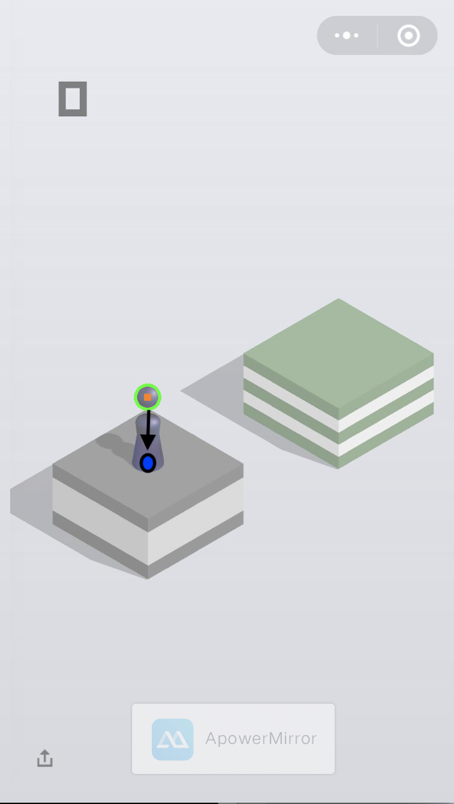
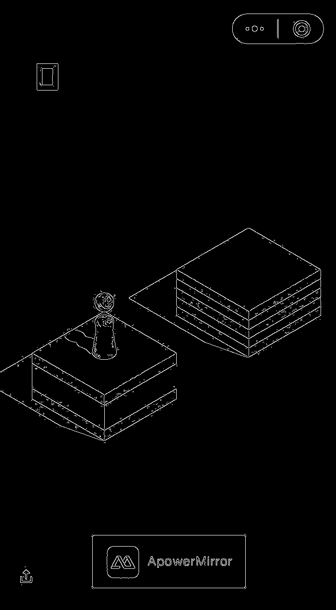
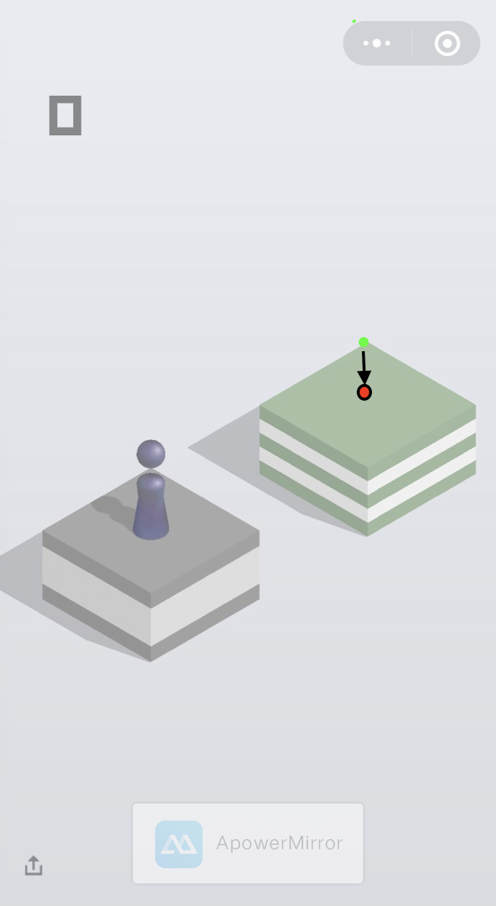
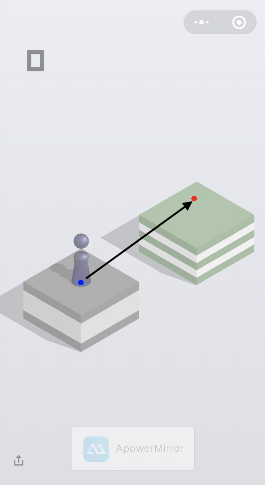
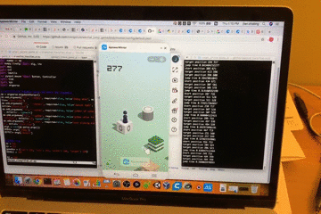

# game_auto_click
Python scripts for mouse auto clicking. 
电脑鼠标自动点击脚本。有两个具体实例：
1. 钢琴游戏《Magic Tiles 3》，magic_tiles3_web.py
2. 微信小程序《跳一跳》，全自动脚本，wechat_tiaoyitiao_ai.py

## 原理说明 

#### 钢琴游戏《Magic Tiles 3》
测试的网络版 [Magic Tiles 3](http://www.bestgames.com/Magic-Tiles-3)
首先，将游戏界面截屏，并且转化成为灰度图，然后找出黑色的按键区域，并在按键区域的最下方按鼠标左键。
为了加快计算速度，只选取每个区域中心的一行像素进行分析。
如图中显示，鼠标左键按在红色箭头处。


程序运行界面图示，左边为游戏界面，右边为程序数据输出界面。


#### 微信《跳一跳》
首先，找出jumper圆形的头（图中绿色圆圈），找到圆心（图中红色标记），并根据jumper的高度计算其底座中心位置（图中蓝色标记），即是jumper的起跳位置。

为了找到jumper的目标位置，先用opencv的Canny算法，生成游戏界面的边界图。

在找到边界图中最靠上方的点（图中绿色标记），把这个最高点投影到jumper跳跃线路的直线上，即jumper跳跃的目标点（图中红色标记）

最后根据起始点和终点直接的距离（图中黑色箭头所示），算出跳跃时间，即鼠标左键按下的时间。

程序运行中，手机界面截屏录像。

程序运行中，电脑屏幕录像。


## 使用说明

#### 获取源码

```
git clone https://github.com/zhazhijibaba/game_auto_click.git

```
#### 运行程序
```
python magic_tiles3_web.py
python wechat_tiaoyitiao_ai.py
```

## 交流
欢迎关注微信公众号：榨汁机爸爸实验室


