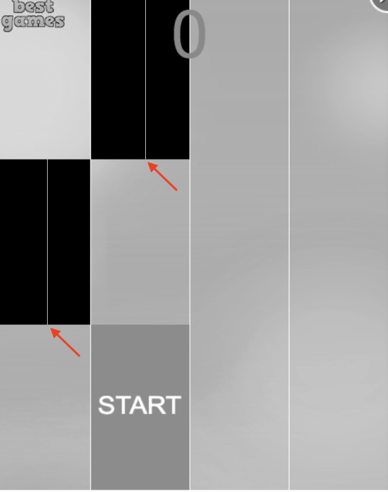
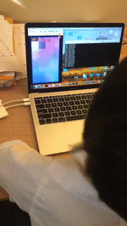

# game_auto_click
Python scripts for mouse auto clicking. 
电脑鼠标自动点击脚本。有两个具体实例：
1. 钢琴游戏《Magic Tiles 3》，magic_tiles3_web.py
2. 微信小程序《跳一跳》，全自动脚本，wechat_tiaoyitiao_ai.py

## 原理说明 

#### 钢琴游戏《Magic Tiles 3》
测试的网络版 [Magic Tiles 3](http://www.bestgames.com/Magic-Tiles-3)
首先，将游戏界面截屏，并且转化成为灰度图，然后找出黑色的按键区域，并在按键区域的最下方按鼠标左键。
为了加快计算速度，只选取每个区域中心的一行像素进行分析。


如图中显示，鼠标左键按在红色箭头处。


程序运行界面图示，左边为游戏界面，右边为程序数据输出界面。

#### 微信《跳一跳》
Opencv 把截图转成灰色的时候，先把整个屏幕节出四个小条，然后拼成一个矩阵，再输入opencv

## 使用说明

#### 获取源码

```
git clone https://github.com/zhazhijibaba/game_auto_click.git

```
#### 运行程序
```
python magic_tiles3_web.py
python wechat_tiaoyitiao_ai.py
```

## 交流
欢迎关注微信公众号：榨汁机爸爸实验室


